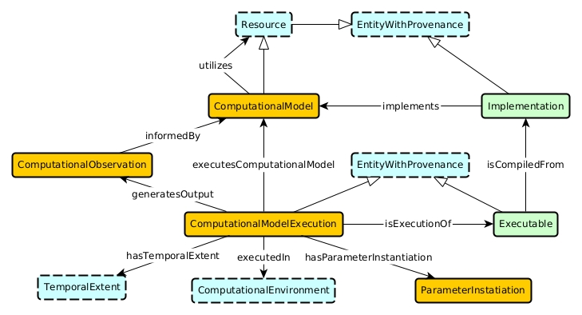

# computational-observation-pattern
An Ontology Design Pattern for Representing Computational Observations

## Schema Diagram

## [Formalization](./computational-observation-pattern.owl)

## Usage
If you use this pattern academically, we kindly ask that you cite our canonical paper, located in the publications folder. 
